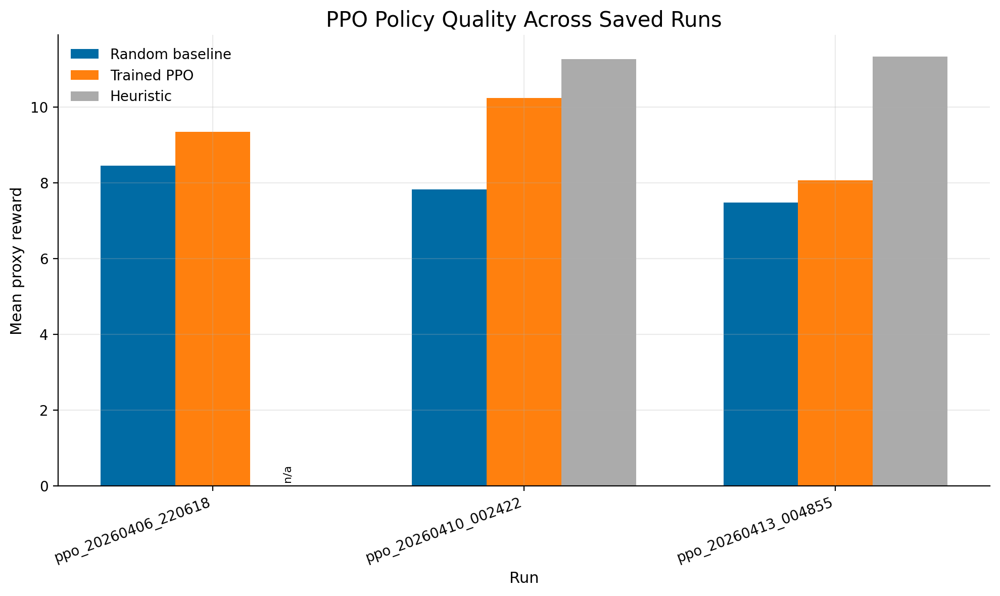
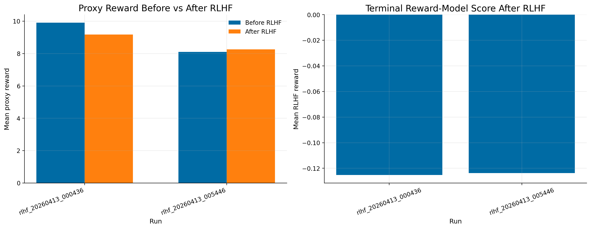
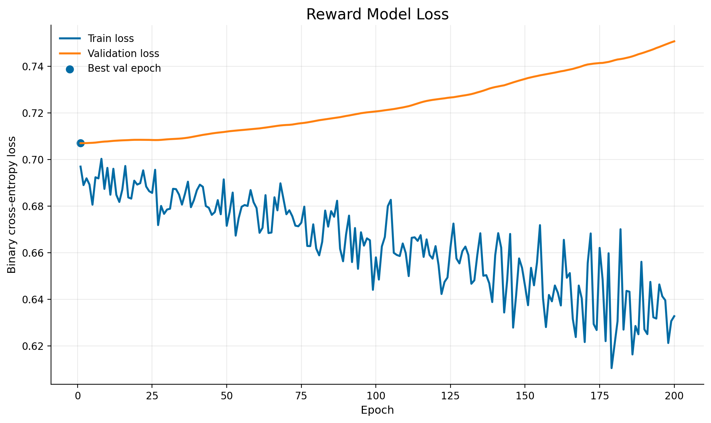

# AI-DJ: Experimental Design, Results and Discussion, and Conclusion

## Experimental Design

We study **automatic DJ sequencing** as a sequential decision-making problem.
Given the current track, an agent chooses the next track and a transition type
(`cut`, `fade`, or `beatmatch`). The environment is built from the Free Music
Archive data stored in `fma_db/data/fma.db`, with track-level features such as
tempo, key, energy, valence, danceability, loudness, chroma, and RMS.

The project tests three hypotheses:

- **H1:** PPO trained on the proxy reward in `DJEnv` will outperform a random
  policy.
- **H2:** Larger PPO runs will improve policy quality, although the learned
  policy may still trail a greedy heuristic baseline.
- **H3:** RLHF fine-tuning with a learned reward model can improve a
  proxy-trained PPO checkpoint, but only if the reward model generalizes well.

The proxy reward used for PPO is:

`0.5 * bpm_smoothness + 0.3 * transition_reward + 0.2 * energy_flow - repeat_penalty`

This reward encourages smooth tempo changes, context-appropriate transitions,
coherent energy flow, and avoidance of repeated tracks. For RLHF, the proxy
reward is replaced with a terminal reward from a learned preference model.

The main experiments use a **500-track subset**, **12-step episodes**, and a
human-preference dataset built from **50 generated sequence pairs**. Three
annotators labeled these pairs; after majority voting, `43` usable preference
examples remained, `7` ties were dropped, and pairwise agreement was `0.5982`.

We ran three experiments:

1. **PPO vs. random:** test whether PPO beats the random baseline and shows an
   upward learning curve.
2. **PPO scaling and heuristic comparison:** compare saved PPO runs at
   increasing timestep budgets and measure the gap to the heuristic baseline.
3. **RLHF fine-tuning:** start from a PPO checkpoint, train a reward model on
   merged preference labels, then fine-tune PPO with terminal reward from that
   model.

The evaluation criteria are:

- **For H1:** PPO must exceed the random baseline and show upward reward trends.
- **For H2:** larger PPO runs should improve reward and ideally narrow the gap
  to the heuristic policy.
- **For H3:** RLHF should improve the starting PPO checkpoint on proxy reward,
  learned reward, or direct human preference. The saved repository mainly
  supports the first two.

## Results and Discussion

### Core Results

| Result | Value |
|---|---:|
| Preference pairs generated | 50 |
| Usable merged preference pairs | 43 |
| Pairwise annotator agreement | 0.5982 |
| Reward-model best validation epoch | 1 |
| Reward-model best validation loss | 0.7070 |

| Run | Timesteps | Random | Heuristic | PPO / RLHF score | Improvement |
|---|---:|---:|---:|---:|---:|
| `ppo_smoke` | 2,048 | 8.1183 | n/a | 8.4567 | +0.3384 vs random |
| `ppo_20260406_220618` | 16,384 | 8.4582 | n/a | 9.3478 | +0.8896 vs random |
| `ppo_20260410_002422` | 65,536 | 7.8289 | 11.2695 | 10.2409 | +2.4120 vs random |
| `ppo_20260413_004855` | 65,536 | 7.4781 | 11.3320 | 8.0709 | +0.5928 vs random |
| `rlhf_20260413_000436` | 32,768 | start 9.9051 | n/a | 9.1785 | -0.7266 vs start |
| `rlhf_20260413_005446` | 32,768 | start 8.1051 | n/a | 8.2579 | +0.1528 vs start |

### Figures

### Analysis

The strongest result is that **PPO consistently beats random**, which supports
H1. All saved PPO runs improve on the random baseline and all show upward
learning curves. The best PPO checkpoint, `ppo_20260410_002422`, reaches
`10.2409`, a gain of `+2.4120` over random. This shows that the proxy-reward
environment is learnable and that the PPO pipeline works end to end.

H2 is **partially supported**. Increasing training scale improves the best
observed PPO result, but performance is not stable across runs. Two runs with
the same `65,536` timestep budget differ sharply: one reaches `10.2409`, while
the later run reaches only `8.0709`. This suggests sensitivity to seed,
initialization, or training variance. In addition, PPO still trails the
heuristic baseline, which stays near `11.3`. The learned policy is useful, but
it has not surpassed the strongest hand-designed strategy under the same proxy
objective.

H3 is also **only partially supported**. One RLHF run improves its starting PPO
checkpoint slightly (`8.1051 -> 8.2579`), but another degrades substantially
(`9.9051 -> 9.1785`). The RLHF effect is therefore not robust. The most likely
reason is the reward model: its best validation loss occurs at epoch `1`, and
validation loss worsens afterward despite lower training loss. That pattern
indicates overfitting or weak supervision.

The reward-model bottleneck is consistent with the dataset size. The reward
model was trained from only `43` usable preference pairs, and human agreement
was moderate rather than high. That is enough to prove the pipeline works, but
not enough to provide a strong, stable learning signal for RLHF. The current
results therefore suggest that **proxy-reward PPO is the strongest component of
the system, while RLHF is limited primarily by reward-model quality**.

### Follow-On Experiments

Three follow-on experiments deepen this interpretation.

1. **PPO scaling:** comparing `2,048`, `16,384`, and `65,536` timesteps shows
   that more training can help substantially, but also exposes variance across
   large runs.
2. **Different RLHF starting checkpoints:** the two RLHF runs suggest that a
   weak reward model can either slightly help or actively hurt an existing PPO
   policy depending on the starting point.
3. **Reward-model diagnostics:** the validation-loss curve itself is a critical
   follow-on experiment, because it localizes the main problem to preference
   modeling rather than PPO implementation.

Overall, the results confirm that the system works technically, but they do not
yet show that RLHF reliably outperforms the best PPO-only policy.

## Conclusion and Future Work

This project explored AI DJ sequencing with PPO and RLHF. The main problem is
interesting because good DJ behavior depends on both objective transition
quality and subjective human judgments of flow. That makes it a natural domain
for combining reinforcement learning with preference learning.

The main finding is that **PPO successfully learns meaningful sequencing
behavior from a structured proxy reward**, consistently outperforming a random
baseline. A second important finding is that **RLHF is not yet reliable in the
current system**. It can produce small gains, but it can also degrade a strong
starting checkpoint. The clearest explanation is that the reward model was
trained on too little and too noisy preference data.

We learned three main lessons:

- proxy rewards are strong enough to make the task learnable;
- RLHF quality depends more on reward-model supervision than on PPO itself;
- small preference datasets are not enough to consistently beat the best
  proxy-trained policy.

With another month or two, the most important next steps would be:

1. collect several hundred preference pairs instead of a few dozen;
2. improve annotation consistency with better instructions and calibration;
3. train a stronger reward model, ideally one that models sequence structure
   more explicitly;
4. run larger held-out human evaluations comparing PPO directly to RLHF;
5. stabilize PPO with repeated seeds and more systematic checkpoint selection;
6. explore hybrid training that mixes proxy reward and learned reward instead
   of replacing the proxy reward entirely.

In short, the project already demonstrates a complete AI DJ pipeline, but its
most important scientific result is that the hard part is not getting PPO to
learn. The hard part is learning a reward model from human preferences that is
strong enough to guide further improvement.
