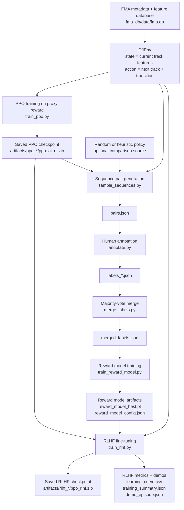
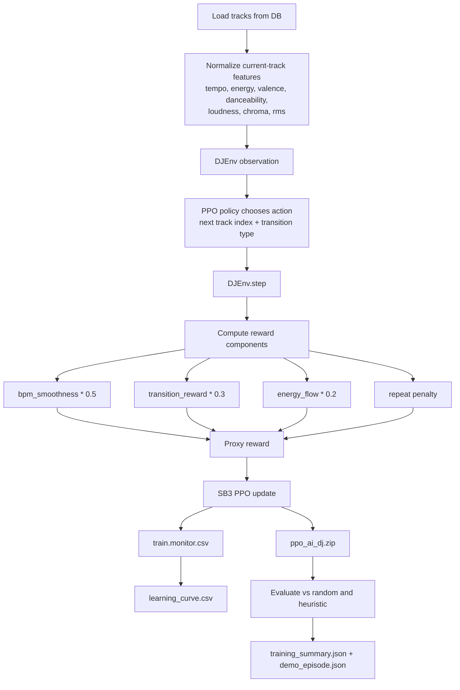
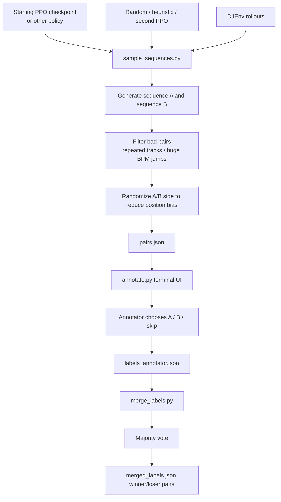
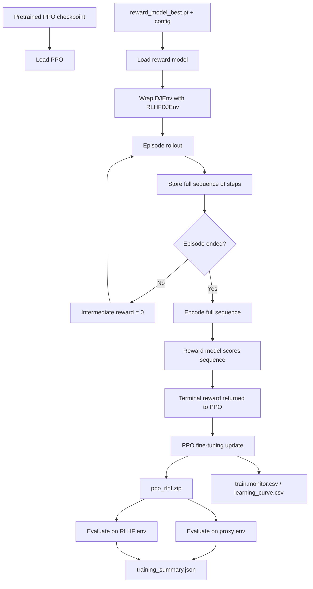
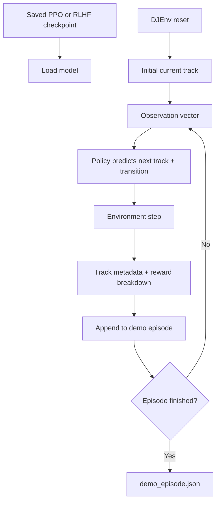

# Pipeline Diagrams

These diagrams summarize the algorithm implemented in this repository. They are
based on the actual code paths in `dj_env.py`, `sample_sequences.py`,
`annotate.py`, `merge_labels.py`, `train_reward_model.py`, `train_ppo.py`, and
`train_rlhf.py`.

## 1. End-to-End Training Pipeline



**Steps**

1. Load track metadata and audio features from the SQLite database.
2. Build `DJEnv`, where the observation is the current track feature vector and
   the action is `[next_track_idx, transition_type]`.
3. Train a PPO policy on the hand-designed proxy reward.
4. Save PPO artifacts, including the model, monitor log, learning curve, demo
   episode, and training summary.
5. Use the PPO policy and an optional comparison policy such as random or
   heuristic to generate sequence pairs for preference labeling.
6. Have human annotators choose which sequence in each pair has better flow.
7. Merge multiple label files by majority vote and drop ties or all-skipped
   pairs.
8. Train a reward model on winner-vs-loser pairs using a Bradley-Terry ranking
   loss.
9. Load the PPO checkpoint and fine-tune it in an RLHF environment where the
   reward comes from the learned reward model.
10. Save the RLHF checkpoint and evaluation artifacts.

## 2. PPO Proxy-Reward Training Pipeline



**Steps**

1. Query the database and keep tracks with real feature data.
2. Convert each current track into a normalized observation vector.
3. Let PPO choose both the next track and the transition type.
4. In `DJEnv.step`, score the transition with:
   `0.5 * bpm_score + 0.3 * transition_score + 0.2 * energy_flow - repeat_penalty`.
5. Return the next observation and proxy reward to PPO.
6. Repeat over many episodes and timesteps.
7. Write episode rewards to `train.monitor.csv` and smooth them into
   `learning_curve.csv`.
8. Save the trained model.
9. Evaluate the trained model against random and heuristic baselines.
10. Save a summary and a demo rollout.

## 3. Preference Data Collection Pipeline



**Steps**

1. Load one or two policies to compare.
2. Roll out both policies in `DJEnv` to produce track sequences.
3. Reject sequences with repeated tracks or very large BPM jumps.
4. Randomly swap which side appears as A or B to reduce annotator position bias.
5. Save generated pairs to `pairs.json`.
6. Show sequence A and sequence B to human annotators in the terminal UI.
7. Record `A`, `B`, or `skip` for each pair.
8. Merge multiple annotators’ labels with majority vote.
9. Drop ties and all-skipped pairs.
10. Convert the final result into `winner` and `loser` training examples for the
    reward model.

## 4. Reward Model Training Pipeline

```mermaid
flowchart TD
    A[merged_labels.json] --> B[Winner sequence]
    A --> C[Loser sequence]
    B --> D[encode_sequence]
    C --> E[encode_sequence]
    D --> F[Flattened feature vector]
    E --> G[Flattened feature vector]
    F --> H[RewardModel MLP]
    G --> H
    H --> I[Score winner and loser]
    I --> J[Bradley-Terry loss<br/>-log sigmoid(r_w - r_l)]
    J --> K[Backpropagation]
    K --> H
    H --> L[reward_model_best.pt]
    H --> M[reward_model.pt]
    J --> N[reward_model_history.json]
    H --> O[reward_model_config.json]
```

**Steps**

1. Read merged winner/loser sequence pairs.
2. Encode each step using tempo, energy, and one-hot transition-type features.
3. Flatten each sequence into a fixed-length vector with zero padding.
4. Feed winner and loser vectors into the MLP reward model.
5. Compute Bradley-Terry ranking loss so the winner should score above the
   loser.
6. Optimize the model with Adam.
7. Track training and validation loss by epoch.
8. Save the best checkpoint, final checkpoint, config, and history.

## 5. RLHF Fine-Tuning Pipeline



**Steps**

1. Load a proxy-trained PPO checkpoint.
2. Load the best saved reward model and its config.
3. Wrap `DJEnv` inside `RLHFDJEnv`.
4. Run an episode while storing the full sequence of selected tracks and
   transitions.
5. Return zero reward at intermediate steps.
6. At episode termination, encode the full sequence and score it with the
   reward model.
7. Return that terminal reward to PPO.
8. Continue PPO fine-tuning using this learned reward signal.
9. Save the fine-tuned RLHF checkpoint and logs.
10. Evaluate the final policy both on the original proxy environment and on the
    RLHF environment.

## 6. Policy Inference / Demo Rollout Pipeline



**Steps**

1. Load a saved policy checkpoint.
2. Reset the environment to a starting track.
3. Build the observation vector for the current track.
4. Predict the next track and transition type.
5. Step the environment and collect transition metrics.
6. Append those fields to the demo trajectory.
7. Repeat until the episode ends.
8. Save the final rollout as `demo_episode.json`.

## Notes

- PPO uses the hand-designed proxy reward in `DJEnv.step`.
- RLHF replaces that per-step reward with a terminal reward from the learned
  preference model.
- The reward model is trained only from human preference comparisons, not from
  the proxy reward directly.
